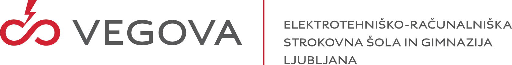

  

# Vegova 2022/23 (Year 4)

In this repository there are contained assignments from my education at Vegova Ljubljana. 

It consists of four subjects:
- NPB is the subject that covers working with databases such as MySQL, Firebird, ...
- RAO covers working with HTML, CSS and JavaScript.
- NSA goes over PHP therefore also touching some HTML and CSS
- RVP covers industry 4. We work with the ESP32 to create IoT devices
